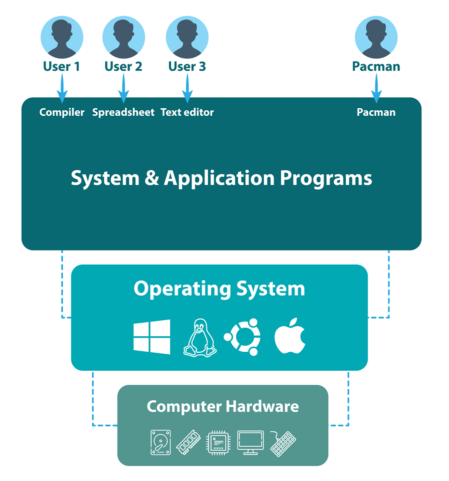
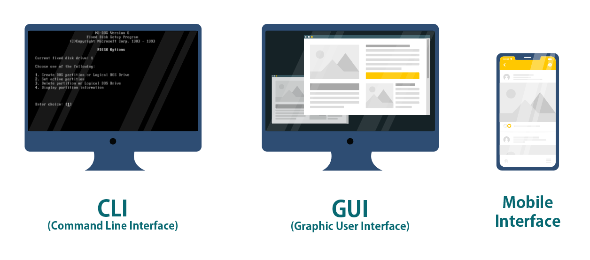
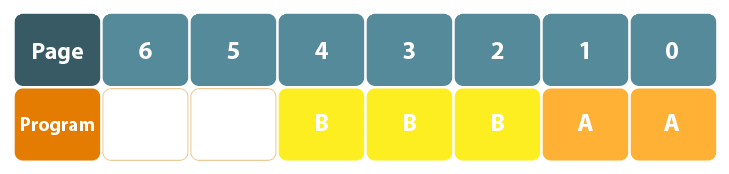
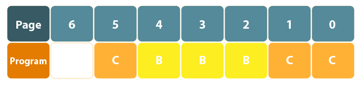

# Belajar Dengan Jenius Python

## Penulis : Gun Gun Febrianza

## *Data Hierarchy*

Sistem operasi adalah sekumpulan program yang mengendalikan perangkat keras komputer dan sumber perangkat lunak yang ada di dalamnya. 

Setiap sistem operasi juga menyediakan **interface** :

1. **Graphical User Interface** (**GUI**)

2. **Command-line Interface** (**CLI**)

3. **Mobile User Interface (Mobile UI)**

### Processor Management

Pada sistem operasi kita dapat melakukan **multitasking** yaitu mengeksekusi lebih dari satu program sekaligus (simultan). Sebagai contoh kita dapat membuka program untuk mengelola dokumen, melakukan **streaming** musik dan program lainnya.

**Multitasking** dapat dilakukan pada :

1. Modern **Operating System**

2. Sistem komputer memiliki cukup memori untuk menyimpan data pada **primary memory** (**RAM**)

### Memory Management

**Management Memory** dilakukan untuk memastikan sekumpulan program dapat berjalan dalam satu waktu. Salah satu metode **memory management** disebut dengan **paging**. Sebuah **memory** dapat direcah menjadi sekumpulan block dengan ukuran **fixed** yang disebut dengan **page**.

Pada **Modern Operating System** ukuran dari **memory pages** sebesar 4 **kilobytes** (KB). Ketika suatu program berjalan, maka **memory** yang dibutuhkan untuk menjalankan program tersebut akan dibuat.

Sistem operasi akan menentukan alokasi jumlah **pages** yang dibutuhkan untuk menjalankan program tersebut. Ketika suatu program telah selesai digunakan maka alokasi **pages** akan dibebaskan kembali agar dapat digunakan oleh program lainnya.

Pada ilustrasi **page** di atas program A membutuhkan 2 **page** yaitu **page** 0 dan 1 dan program B membutuhkan 3 **page** yaitu **page** 2, **page** 3 dan **page** 4. 

Jika program A selesai dan kita mengeksekusi program C yang membutuhkan 3 ****page**** saat program B masih berjalan, maka **page** 0, **page**  1 dan **page** 6 akan digunakan oleh program C seperti pada gambar di bawah ini :

Setiap **pages** yang digunakan oleh program bersifat **contiguos**, dapat berurutan atau acak. Sistem operasi akan menentukan **page** mana yang akan digunakan dan membaca kembali data ketika dibutuhkan.

### *Field*

### *Record*

Beberapa *field* yang saling berhubungan atau memiliki kesamaan dapat digunakan untuk membangun suatu *record*. Misalkan dalam sistem kependudukan, anda tentu memiliki beberapa *fields* diantaranya adalah nama, tempat & tanggal lahir, jenis kelamin, status dan sebagainya. Ketika masing-masing *field* terisi maka kita akan membentuk suatu *record*.

### *Files*

Secara umum sebuah *file* dapat berupa ***arbitrary data\*** dengan ***arbitrary format\***. Sebagai contoh dengan ***notepad.exe\*** kita dapat membuat sebuah tulisan berisi ***plaintext\*** kemudian menyimpanya ke berbagai format seperti, **.txt, .md, .html** atau bahkan menyimpanya dengan format yang tidak dikenali oleh program dalam suatu sistem operasi (misal dengan format .**xxxasdqwe**).

Di beberapa sistem operasi sebuah *file* dikatakan dengan serangkaian *bytes* yang membentuk suatu *file*.

### *Database*

*Database* adalah sekumpulan data yang teroganisir dengan baik agar bisa diakses dan dimanipulasi. Model pembuatan *database* yang paling terkenal adalah *relational database*, data disimpan ke dalam sebuah *table* yang berisi *record* dan *fields*.

### *Big Data*

***Big Data\*** adalah terminologi yang menjelaskan sebuah fenomena data dengan *volume* yang sangat besar (*High Volume Data*), data dengan struktur yang bervariasi (*High Varied Data*) dan data diproduksi dengan kecepatan yang sangat tinggi (*High Velocity Data*). 

Ketersediaan internet, kecepatan internet, *web application* dan produksi perangkat elektronik seperti *smartphone*, komputer, laptop dan *tablet* menciptakan ledakan data dengan pertumbuhan yang sangat cepat.

Dengan 2,4 milyar pengguna aktif pada kuarter kedua tahun 2019 *facebook* menjadi *platform* jejaring sosial (*social media*) terbesar didunia. Sebuah *platform social media*, dapat memproduksi berbagai jenis data seperti gambar (*image*), vidio (*video*), teks (*text*) dan suara (*voice*) dengan kecepatan yang sangat tinggi.

------------------------

