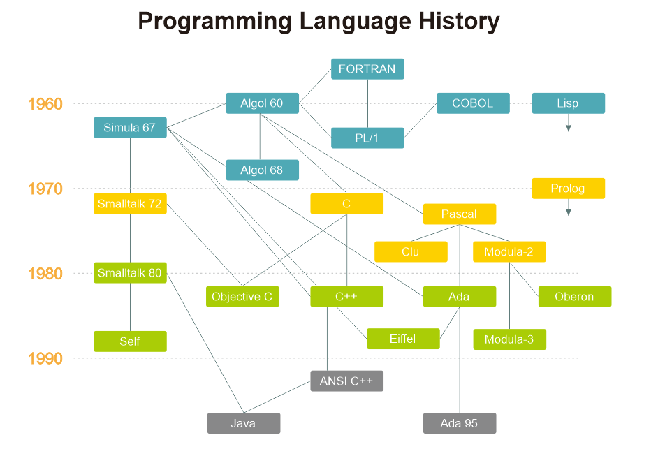

# Belajar Dengan Jenius Python

## Penulis : Gun Gun Febrianza

## Progamming Language

Selalu ingat, komputer hanya memahami satu bahasa yaitu **Machine Language**.

Bahasa pemrograman adalah bahasa formal untuk mengekspresikan suatu komputasi yang akan dikerjakan oleh sebuah mesin yaitu komputer. Bahasa formal adalah bahasa yang didesain secara khusus oleh seseorang untuk **specific applications**. 

Bahasa pemrograman secara tradisional dilihat dari tiga segi aspek : [1]

1. **Syntax** sebagai struktur dari bahasa pemrograman.

2. **Semantic** sebagai makna dari bahasa pemrograman.

3. **Pragmatic** sebagai implementasi dari bahasa pemrograman.

Bahasa pemrograman di desain **human-readable** untuk mempermudah kita dalam memberikan instruksi kepada mesin komputer. Dalam pemograman terdapat dua cara untuk menterjemahkan ke dalam bahasa mesin yaitu :

1. Menggunakan **Interpreter**

2. Menggunakan **Compiler**

### Programming Language History

Di bawah ini adalah diagram sejarah perkembangan bahasa pemrograman :

Terdapat 5 generasi bahasa pemrograman, semakin maju generasi semakin tinggi **abstraction** bahasa pemrogramannya :

**1.**  **Machine Language**

**2.**  **Assembly Language**

**3.**  **High Level Procedural Language**

**4.**  **Non-procedural Language**

**5.**  **Natural Language**

### The First Generation (1940s)

### The Second Generation (1950s)

### The Third Generation (1955-1965)

### The Fourth Generation (1980)

---------------------

[1] Turbak, Franklyn and Gifford, David, "Syntax, Semantic and Pragmatic," in *Design Concept In Programming Language*, USA: MIT Press, p. 4.