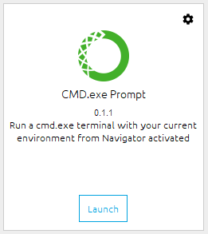

# Belajar Dengan Jenius Python

## Penulis : Gun Gun Febrianza


## *Anaconda Install Packages*

Sekarang kita akan mempelajari cara melakukan instalasi **packages** dalam **anaconda**, Klik **CMD.exe prompt** :



Kemudian eksekusi perintah di bawah ini untuk melakukan instalasi package jupyter-matplotlib, sebuah **visualization** **library** yang sangat populer digunakan dengan **jupyter notebook** :

```python
$ conda install -c conda-forge ipympl
$ conda install nodejs
$ jupyter labextension install @jupyter-widgets/jupyterlab-manager
$ jupyter labextension install jupyter-matplotlib
```

